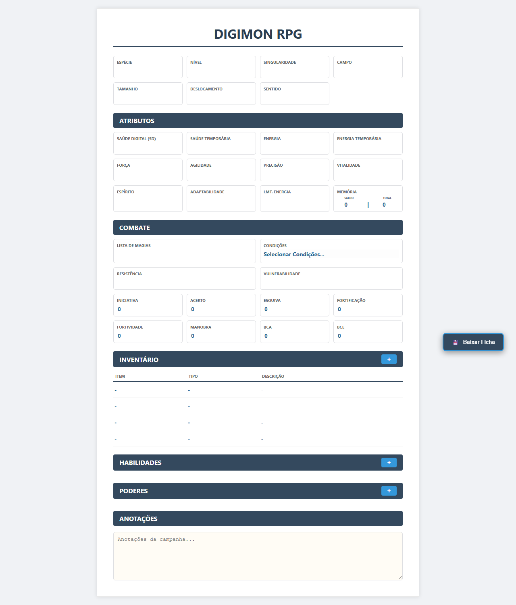
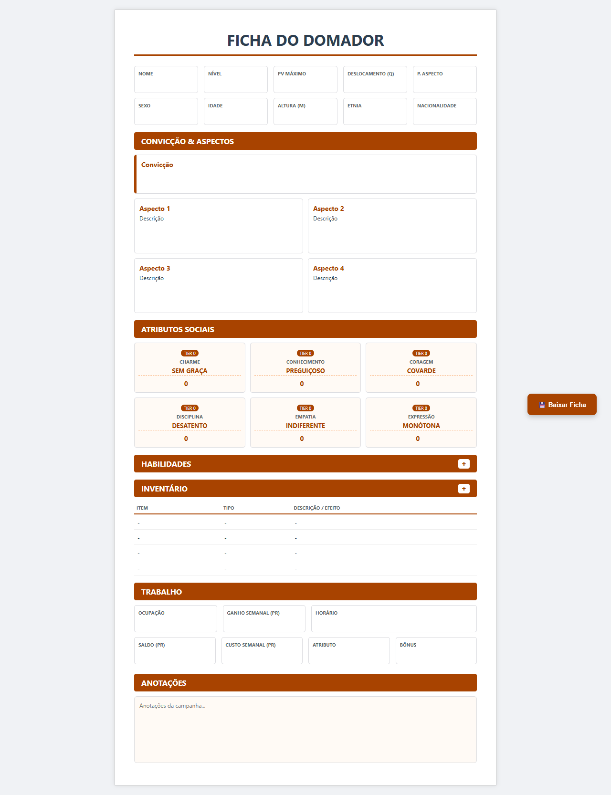

# Fichas HTML ASAFE

Fichas autocontidas de Digimon e Domador para preenchimento diretamente no navegador. Cada ficha reúne HTML, CSS e JavaScript em um único arquivo que pode ser aberto, editado, baixado e reaberto sem servidor ou conexão com a internet.

## Problema resolvido

Fichas editáveis normalmente dependem de uma aplicação hospedada ou perdem o estado quando a página é fechada. Este projeto mantém a portabilidade de um arquivo HTML único e permite incorporar os dados preenchidos em uma nova cópia baixada pelo usuário.

## Prévia

| Ficha de Digimon | Ficha de Domador |
| --- | --- |
|  |  |

As imagens acima são os baselines reais utilizados pelos testes de regressão visual.

## Funcionalidades

- preenchimento de campos de identificação, atributos, combate, trabalho e anotações;
- inventário com inclusão dinâmica de linhas;
- criação, edição e exclusão de habilidades;
- criação, edição e exclusão de poderes na ficha de Digimon;
- seleção de condições do Digimon;
- cálculo dos tiers de atributos sociais do Domador;
- validação dos campos obrigatórios dos modais;
- navegação de modal por teclado, contenção de foco e nomes acessíveis;
- aviso de alterações não salvas;
- download da ficha com o estado atual incorporado;
- reabertura e novos salvamentos do HTML baixado;
- sanitização do nome do arquivo e serialização segura da entrada do usuário;
- funcionamento offline e sem dependências de runtime.

## Uso

Não é necessário instalar Node.js para preencher as fichas.

1. Baixe ou localize `DRPG_Ficha_Digimon_v1.5.html` ou `DRPG_Ficha_Domador_v1.4.html`.
2. Abra o arquivo diretamente em um navegador moderno.
3. Preencha os campos e use os botões `+` para inventário, habilidades ou poderes.
4. Clique em `Baixar Ficha`.
5. Abra o HTML baixado para continuar a edição posteriormente.

O arquivo baixado contém o estado atual dos controles. Textos digitados são serializados como texto ou atributos escapados e não são interpretados como marcação executável.

## Arquitetura

Os fontes são organizados por responsabilidade durante o desenvolvimento. O build incorpora tudo nos dois HTMLs finais:

```text
templates + components + styles + shared.js + script específico
                              │
                              ▼
                 HTML autocontido distribuível
```

- `src/templates/`: estrutura principal de cada ficha;
- `src/components/`: inventários, modais e atributos sociais;
- `src/styles/`: estilos específicos e ponto compartilhado;
- `src/scripts/shared.js`: criação de elementos, foco, serialização, nome de arquivo e download;
- `src/scripts/digimon.js` e `domador.js`: regras e interação de cada ficha;
- `scripts/build.mjs`: composição determinística dos artefatos;
- `scripts/validate-source.mjs`: guardas contra APIs inseguras e código inválido.

Essa separação mantém os fontes legíveis sem quebrar o requisito de distribuição em arquivo único. O projeto não utiliza React, backend, API, banco de dados ou gerenciamento global de estado porque essas responsabilidades não existem no produto.

## Tecnologias

| Área | Ferramenta |
| --- | --- |
| Interface | HTML5, CSS3 e JavaScript nativo |
| Build | Node.js com módulos ESM |
| Testes unitários | `node:test` |
| Testes funcionais e visuais | Playwright |
| Validação de HTML | html-validate |
| Validação de CSS | Stylelint e postcss-html |
| Integração contínua | GitHub Actions em Windows/Chromium |

## Desenvolvimento local

### Pré-requisitos

- Node.js 20.17 ou superior;
- npm 10 ou superior;
- Git.

### Instalação

Após obter o repositório:

```powershell
npm ci
npx playwright install chromium
```

O projeto não usa variáveis de ambiente. Nenhum arquivo `.env` ou configuração de credenciais é necessário.

### Fluxo de alteração

1. Edite os arquivos em `src/`.
2. Gere os HTMLs da raiz.
3. Execute as validações e os testes.
4. Revise qualquer diferença visual antes de atualizar snapshots.

```powershell
npm run build
npm test
```

Os HTMLs da raiz são artefatos de distribuição e não devem ser editados manualmente.

## Comandos

| Comando | Finalidade |
| --- | --- |
| `npm run build` | Gera os dois HTMLs autocontidos |
| `npm run build:check` | Confirma que os artefatos correspondem aos fontes |
| `npm run validate` | Valida build, JavaScript, HTML e CSS |
| `npm run test:unit` | Executa os testes Node |
| `npm run test:unit:coverage` | Mede a cobertura dos módulos Node testados |
| `npm run test:e2e` | Executa fluxos, acessibilidade e snapshots Playwright |
| `npm test` | Executa build, validações e todas as suítes |

Detalhes da estratégia, do escopo e das limitações estão em [TESTING.md](TESTING.md). A verificação manual está em [REGRESSION_CHECKLIST.md](REGRESSION_CHECKLIST.md).

## Estrutura do repositório

```text
.
├── .github/workflows/ci.yml       integração contínua
├── scripts/                       build e validação de fontes
├── src/                           fontes editáveis
├── tests/                         Playwright funcional, acessível e visual
├── unit-tests/                    testes Node
├── DRPG_Ficha_Digimon_v1.5.html   artefato distribuível
├── DRPG_Ficha_Domador_v1.4.html   artefato distribuível
├── TESTING.md                     estratégia de testes
└── REGRESSION_CHECKLIST.md        validação manual
```

## Segurança

- Não existem chamadas de rede, autenticação, cookies, armazenamento web ou credenciais de aplicação.
- O validador rejeita `innerHTML`, handlers inline, `eval`, URLs `javascript:` e APIs equivalentes de injeção.
- Os testes salvam e reabrem entradas contendo `<script>` para verificar que permaneçam como texto.
- Dependências são verificadas com `npm audit` no workflow de CI.

Um HTML é código executável por definição. Abra fichas recebidas de terceiros somente quando confiar na origem; a proteção da serialização cobre a entrada digitada na aplicação, não código previamente inserido por outra pessoa no arquivo.

Não publique credenciais em issues. Relatos de segurança devem ser enviados por um canal privado definido pelo mantenedor do futuro repositório público.

## Limitações conhecidas

- O layout tem largura fixa e é orientado a desktop; responsividade móvel ainda não é suportada oficialmente.
- Os snapshots visuais possuem Windows/Chromium como plataforma canônica.
- Não há sincronização em nuvem, colaboração simultânea ou armazenamento centralizado.
- Impressão não possui uma suíte visual dedicada.
- Bloqueios de download impostos por políticas específicas do navegador dependem de validação manual.

## Melhorias futuras possíveis

- avaliar layout responsivo caso mobile se torne requisito;
- reduzir estilos inline restantes de forma incremental e visualmente validada;
- ampliar a validação manual com leitor de tela real;
- criar releases contendo os HTMLs gerados após a publicação do repositório.

## Contribuição

Consulte [CONTRIBUTING.md](CONTRIBUTING.md) antes de propor alterações. Mudanças devem preservar o funcionamento offline, os formatos dos arquivos e os fluxos de salvar/reabrir.

## Licença

Este projeto ainda não possui uma licença definida. A publicação do código não concede automaticamente permissão de reutilização; o arquivo `LICENSE` deve ser adicionado somente após decisão explícita do titular.
